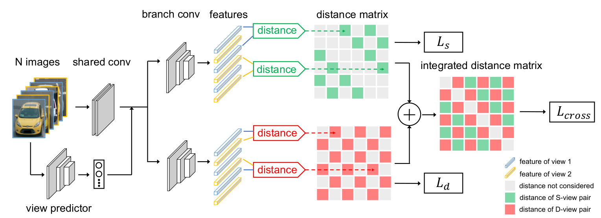

# VANET
Code reproduce for paper "Vehicle Re-identification with Viewpoint-aware Metric Learning"


## Introduction

This is the implementation of article VANet **"Vehicle Re-identification with Viewpoint-aware Metric Learning"**, which support both
single-branch training and two branch training.




## Implementation details 

The whole implementation is based on PVEN project(https://github.com/silverbulletmdc/PVEN). The key code block added and modified are mainly distributed as follows:
   
    For network construction:
        This project provide two version of backbone, namely 'googlenet' and 'resnet50' respectively. There the corresponding configuration files 
        as well as other corresponding code interfence are all provided completely.
        code location: vehicle_reid_pytorch/models/vanet.py
    
    For training:
        This project provide two mode of training, namely 'single branch(baseline of VANet)' and 'two branch(VANet)' respectively
        code location: examples/parsing_reid/main_vanet_single_branch.py
        code location: examples/parsing_reid/main_vanet_two_branch.py
    
    Configuration files:
        code location: examples/parsing_reid/configs/veri776_b64_baseline_vanet_single_branch_resnet.yml
        code location: examples/parsing_reid/configs/veri776_b64_baseline_vanet_two_branch_resnet.yml
        code location: examples/parsing_reid/configs/veri776_b64_baseline_vanet_two_branch_googlenet.yml
    
    For loss calculation:
        code location: vehicle_reid_pytorch/loss/triplet_loss.py
    
    For evaluation:
        mAP, cmc, ..., hist distribution figure drawing function are included.
        code location: examples/parsing_reid/math_tools.py


## Results comparasion

We have achieved the following preformance by using the method this paper 'VANET' provided. 

         -------------------------- -----------------------------------
                      |    mAP    |   rank-1  |   rank-5  |  rank-10  |
         --------------------------------- ----------------------------
          VANET+BOT   |   80.1%   |   96.5    |   98.5    |    99.4   | 
         --------------------------------------------------------------
          BOT(ours)   |   77.8%   |   95.3    |   97.8    |    98.8   |
         --------------------------------------------------------------
          BOT[1]      |   78.2%   |   95.5    |   97.9    |      *    |
         --------------------------------------------------------------

Note：
The 'BOT', which means "bag of tricks" proposed by paper[2].
With respect to the two branch implementation of the above "VANET+BOT", we adopted the first 6 layers of the official resnet50 as the shared_conv network, the remaining two layers as the branch_conv network.There are also instructions in the corresponding code when you use.


Also, four type data's(similar-view_same-id, similar-view_different-id, different-view_different-id, different-view_same-id) distribution are drawn based on paper's aspect.
note: this visualization code can be founded at examples/parsing_reid/math_tools.py 


### 1. Get started

All the results are tested on VeRi-776 dstasets.
Please reference to the environment implementation of other general reid projects, this project reference to fast-reid's. 


### 2. Training

Reference to folder run_sh/run_main_XXX.sh
Note: If you want to use your own dataset for training, remember to keep your data's structure
be consistent with the veri776 dataloader's output in this project, reference to realted code for more details.

Example:
      
      sh ./run_sh/run_main_vanet_two_branch_resnet.sh

### 3. evaluation

Reference to folder run_sh/run_eval_XXX.sh
Note: We have add 'drawing hist graph' function in evaluated stage, if you needn't this statistic operation temporarily,
remember to shut down this function, for the operation is to some extent time-consuming, detail code block are located in examples/parsing_reid/math_tools.py.

Example:

      sh ./run_sh/run_eval_two_branch_resnet.sh

### reference
[1] Khorramshahi, Pirazh, et al. "The devil is in the details: Self-supervised attention for vehicle re-identification." European Conference on Computer Vision. Springer, Cham, 2020.

[2] Luo, Hao, et al. "Bag of tricks and a strong baseline for deep person re-identification." Proceedings of the IEEE/CVF Conference on Computer Vision and Pattern Recognition Workshops. 2019.


## Contact

For any question, please file an issue or contact

```
Shichao Liu (Shanghai Em-Data Technology Co., Ltd.) liushichao0601@gmail.com
```


